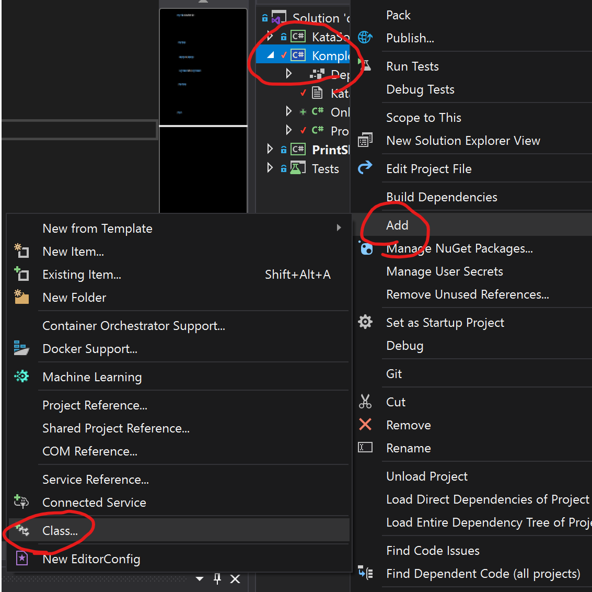
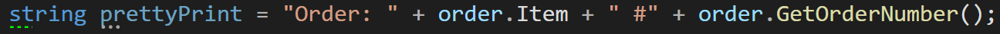
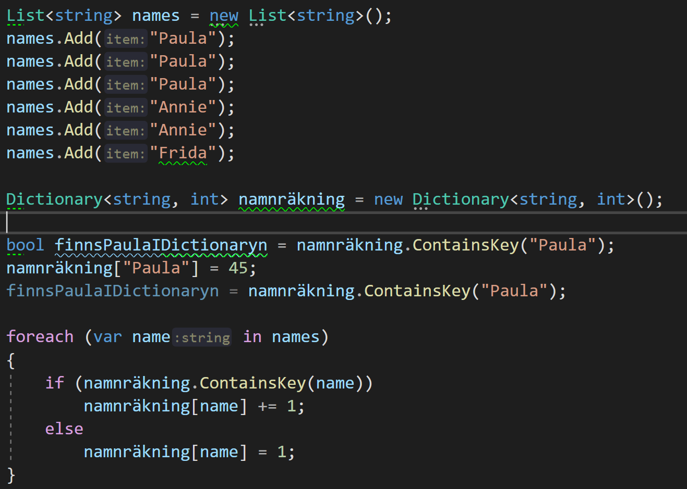

(Installera [denna](https://marketplace.visualstudio.com/items?itemName=MadsKristensen.MarkdownEditor) VS2019 extention för att se readme:n lokalt)

## Onlinebeställningssystem

Syftet är att skapa ett (simpelt konsoll-) system där man kan lägga beställningar och få en översikt över alla beställningar som är i omlopp.

#### Kodsteg
1. Skapa en komplex datatyp för att hålla koll på en online beställningsorder (`Add > Class...`).
	>Ha med saker som ordernummer, produktnamn, beställningsdatum, betalsumma och annat viktigt du kan komma på.
	
	

2. Skriv till en konstruktor som automatiserar skapandet av beställningen. 
	>Vad som beställs och hur mycket det kostar borde vara parametrar in till konstruktorn.
    
    >Tidpunkt för beställningen och tilldelning av ett unikt ordernummer är sådant som konstruktorn själv kan beräkna och tilldela.

3. Skapa en beställning med 'new' och kalla på din konstruktor.
	Skapa två variabler var1, var2 som nedan.
	```c#
	DinKlass var1 = new DinKlass("cyckel");
	DinKlass var2 = var1;
	```
	Testa sedan att ändra något värde i objektet via 'var1' variabeln.
	```c#
	var1.OrderName = "hej svejs";
	```
	Debugga och kolla på var2. Vad hände med det objektets värden och varför?

4. Använd `private` nyckel-ordet för att se tiill att man inte kan ändra
	ordernummer på en redan skapad beställning.

	Använd `public` nyckel-ordet på en metod och gör så att man ändå kan få tag på
	ordernummret även fast det är private och inte går att ändra på utifrån.

5. Lägg till en lista(`List<Order>`) till konsolprojektet (`Program.cs` i detta projektet) som 
	håller dina beställningar. 
	
	Skriv kod för alternativ 1 till 3 där du använder konstruktorn
	för att lägga till nya objekt till listan.
	
	_Exempel_: trycker man 1, 1, 1 så ska man ha beställt tre elektriska cyklar 
			 och listan ska innehålla tre objekt.

6. Lägg till kod för alternativ 5. En `foreach` loop som går igenom och skriver ut
	hela listan av beställningar på ett fint och informativt sätt.
	
	

7. Lägg till kod för alternatv 4. Man ska själv kunna skriva in namnet på produkten man beställer.

8. Lägg till kod för alternativ 6. Ha en dictionary som tar `string` som key-type och `int` som value-type.
	Gå igenom alla beställningar och öka value i dictionary med ett 
	för varje gång namnet på en produkt dyker upp.
	
	

